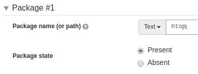
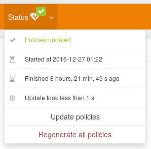

= Getting started with

:icons: font
:experimental:
:source-highlighter: coderay

image::images/color_logo_horizontal_small.png[Rudder]

== Introduction

Rudder is a an *automation* and *compliance* solution dedicated to production constraints.
This guide is designed to help you discover Rudder workflow, and will make you able to:

* Setup Rudder agent
* Manage Nodes with Rudder
* Create configuration polices using built-in components
* Create your own configuration policies
* Apply and control the enforcement of these policies

It requires no prior knowledge about configuration management,
only basic Unix command-line skills.

[NOTE]

====

This guide is targeted for the lastest major release of Rudder, but
applies to all Rudder versions.

====

We hope you enjoy you trip, and we would be glad to get feedback about this guide or
Rudder documentation resources more generally.

== Setup a test environment

This section will help you setup a test environment. The rest of the tutorial assumes you are
using this `rudder-vagrant` environment (you can also setup your own, 
you will only have to substitute hostnames/IP addresses when necessary).

This installation method is cross-platform, and you can use it on Linux, Microsoft Windows, Mac OS X
and more.

You will need:

* VirtualBox, tu run the demo virtual machines (https://www.virtualbox.org/wiki/Downloads[Download])
* Vagrant, to handle the virtual machines configuration and provisionning (https://www.vagrantup.com/downloads.html[Download])

On Debian/Ubuntu systems, just run `sudo apt-get install -y virtualbox vagrant`, and on RHEL/Fedora systems,
run `sudo yum install -y VirtualBox vagrant`.

Once they are installed, run:

----
git clone https://github.com/Normation/rudder-vagrant.git 
cd rudder-vagrant
----

You can also directly download the rudder-vagrant content with this https://github.com/Normation/rudder-vagrant/archive/master.zip[link].

And then, to create the environement:

----
vagrant up
----

This will download the virtual machine image if needed, and will setup a Rudder environment using two virtual machines.
This will likely take some time, so feel free to grab a coffee before we dive into Rudder.

[TIP]

.Vagrant commands

====

Here are the basic vagrant commands useful to manage your environment:

* `vagrant up` to bring the environment up, wether the VM need to created or only started
* `vagrant halt` to stop the virtual machines (but keep them for later use)
* `vagrant destroy` to totally remove virtual machines

====

Once the command returns, you are ready to get started!

== First Steps

=== High Level Overview

[NOTE]

====

In this section, you will learn:

* The root concepts behind Rudder
* The high-level workflow
* To access to the Web user interface

====

Lets start with a very broad overview of what does Rudder and of the high level concepts
(don't worry, it will be done for abstract topics after that, and we will
start doing *actual* things).

It has two main components:

* A *server* (called the _Root Server_)  that defines the desired state of the whole inftrastructure
* An *agent* that will continuously compare this state with the actual state of the infrastrucutre, and
  report about the differences, and possibly bring the infrastructure into the desired state.

What is a _Desired State_? It describes the state of system components:

* The content or metadata (permissions, etc.) of a *file*
* The state (started or or not) of a *service*
* The state (installed or not) of a *software package*
* etc.

But also it can also be seens as sets of low level components that have a higher level meaning like:

* The state of security upgrades
* The compliance with a given norm

You may find (in Rudder documentation) the word *promise* to designate
a desired state. What is important to remember is that we are not giving instruction or
commands that need to be executed on the system, but only describing what the
*target state* is. The role of the Rudder agents is to figure out how to
achieve the changes.

[NOTE]

.About promise theory

====

TODO

====

=== Rudder Web Interface

Now let's get started with Rudder! We will connect to the Web interface of the server.
To to so, go to https://localhost:8081/. You will have to bypass the certificate verification, as the default
installation uses a self-signed certificate.

Then you will arrive to a login page. The default user is "admin" and its password is "admin".
Click on menu:Sign in[], and you are in! You will land on Rudder dashbord, which shows
key statistics about your infrastructure (it looks a bit empty for now, but we will fix that soon).

== Nodes Management

The first entity you will manipulate are Nodes. What is a Node in Rudder? It is a machine where a Rudder agent is installed.
A node is linked to a Rudder Root server which defines its desired state.

The Rudder agent is a *pull*-based agent. This means it is always the agent that will connect to the server to get
configuration policies (i.e. a desired state).

The test environment contains a server and a node with an installed agent. We will now see how to set up the link
between those two.

[NOTE]

.Why using an agent? Why using an autonomous agent?

====
TODO

agent/agentless
push/pull / remote

====

=== Adding a new Node

The general idea to add a new under Rudder control is to tell this node wich server it should
ask policies for, and then to make it send an inventory (a description of itself) to this server.
Then the server can accept this request, and actually start managing it.

This is done by:

* Configuring the Rudder server hostname or IP on the Node. It is set in `/var/rudder/cfengine-community/policy_server.dat`.
  This is already done on the test node.
* Trigger an inventory on the Node. The Node will tell the server it exists
by sending various data about its current state (hardware inventory, installed packages, etc.)
This is already done on the test node.
* Accept the Node on the server. From this point, the Node will be managed by your Rudder server,
so you have to check if it is really a Node you want to add.

[NOTE]

.Inventories

====

The Rudder agent includes an inventory tool that will be triggered every night to
keep this data up to date.

The inventory includes:

* Hardware information (models, serial, etc.)
* Networking information (MAC and IP addresses, routes)
* File systems (mountpoint, filesystem, etc.)
* Installed software
* Running processes
* Environment variables
* Virtual Machines

All of these can be used as criteria for search queries (or group queries as we'll see later).

====

The Node is already configured and has sent an inventory to the server: we only have to accept it.

To do this, go into menu:Node Management[Accept new node]. Here are all the Nodes that 
have sent an inventory to our server, but that are not accepted yet. You should have exactly one, called *node.rudder.local*.

You can browse and the inventory data before accepting it, by clicking on the Node line. The 'Directive'
can be ignored for now, you just have to know that it lets you review the configuration policies
that will be applied if the Node is accepted.

image::images/accept.png[Accept a new Node]

You can the select the node using the checkbox, and click on menu:Accept into Rudder[]. You also have to confirm it,
as it is an important decision. The pending Nodes list is now empty, and we can start serious business!

If you go to menu:Node Management[List Nodes], you will now have two nodes, the newly added node and the server itself.
It simply means that the server, besides defining expected states for the infrastructure, also manages itself like any other node.
We did not have to accept it because server is automatically accepted.

=== Groups

We will see how to apply policies to nodes, but we can already  see how they will be linked to those Nodes.

In Rudder, you cannot link a policy directly to a Node, but you will use Groups instead.
Groups are sets of nodes, based on a search query upon inventory data.

Example group definitions are "the nodes running Debian 8 with more then 8GB RAM" or "The nodes running RHEL
with a defined node property "DATACENTER" with the value "Paris".

Let's create the group of Ubuntu servers!

Go to menu:Node Management[Groups], where you will see the built-in Groups
in the left tree (named *System Groups*). Then click on menu:Create[], and fill the form:

What is important to know about this form is:

* *Categories* are set of groups. You can use them as group folder, to organize a hierarchy of groups. They have no semantic use in Rudder.
* There are two group types:
** *Dynamic* groups are updated dynamically. This means nodes will enter or leave the group automatically depending on their inventory data.
** *Static* groups are only evaluated when triggered manually. This gives more control over what happens on nodes, but less flexibility.
* The *Description* is the documentation for your group
* The *Audit Log* message in not about documenting the group itself but the fact on making a change on the policies.
  It is present in all actions that may have an impact on the configured desired state, and allows keeping track of what is done.
  We will see a bit more about it in the last section.

Then click on menu:Create[] and you will get to the group form itself. Here we will build the following query:

Click on menu:Search[] and the *node.rudder.local* should appear in the nodes list below. We are all good, click on menu:Save[] in
the lower right of the screen, and confirm by clicking on menu:Update[].

It is all you need to know about Nodes and Groups, lets now build policies!

== Configuration Management Fundamentals

[NOTE]

====

In this section, you will learn:

* The base item of Rudder configuration policies, the *Directive*
* How to apply a policy to a node
* The concepts of  *Policy Generation*

====

How to act on our nodes?
By defining a configuration policy.

How to create a configuration policy?
Directive.

Let's create a first directive, and apply it to our node.

Let forget the Rules for now, and apply it everywhere.

=== Defining a first policy

Lets define a policy, go to menu:Configuration Policy[Directives]. The left tree shows al the built-in
policies you can parametrize and apply. 

These are called *Techniques* But hey, we are talking about creating a Directive, don't we? 

We will create a *Package Management* directive. Click on in in the tree, and on menu:Create with latest version[].

[NOTE]

.Techniques versionning
====

All techniques are versionned, and you can see the versionning policy on https://rudder.userecho.com/topics/20-how-are-rudder-techniques-versioned/[this page].

====

Now we arrived in the Directive form. We want to install some perfomance diagnostic tools as part of our standard tools,
for example the *htop* package.

In the upper part, enter the name os the directive, *htop setup*, and enter in the directive parameters form:

We can fill only the package name, and let everything else default. Tis will ensure the
package is installed without any specific constraint.

Lets save with the lower right menu:Save[] button.

=== Applying a policy

We have defined a piece of configuration policy, but it is only stored on the server for now.
We need to associate it a a Node (to a Group actually) so that it is usable by the agent.

The link between a set of Nodes and a set of Directives is a Rule.
To add one, got ot menu:Configuration Policy[Rules]. You can see the default Rule
that is by default linked to the system group that contains all nodes.

To create a Rule, click on menu:New Rule[], and give it a name.

Then you see the Rule form, specifically the menu:Settings[] tab:

Select the group of Ubuntu nodes and the htop setup directive by clicking on them, and save the rule.

=== Policy Generation

We have just defined a configuration item named a Directive, and we asked Rudder to apply it to a node.
What happens next, before the actual application by the agent, is a step of policy *generation*.
You can see it as a kind of compilation step, that will use the information from the inventories and the configuration
policies to generates applicable configuration policies (or *promises*).

[NOTE]

.Generation Engine

====

====

The generation engine status is displayed permanently in the upper right of the interface. A green tick shows that
the policies are correctly generated and up to date.

It gives the current status, and allows trigerring a manual policy re-computing (which is not necessary in daily usage).

Here we are. Policies are generated according to our choices. The nodes will automatically synchronize
and apply them.

Nevertheless, we can have a look at what happens on the Node.

== Rudder agent

We will here focus on what happens on the Node. As we have seen in the previous section, it 
is not necessary to take any action directly on the node (once the are managed by Rudder), but we we still
have a look to understand what is going on there.

For now, we know the agent:

* Gets and applies the configuration policies (every 5 minutes by default)
* Sends an inventory (daily)

We will see how to manually take control of the agent and perform those tasks directly on a Node.

To do so, connect to the node using:

----

vagrant ssh agent

----

You should get a prompt on the node. We we only need one command here,
which is (quite conveniently) named *rudder*.

We will now perform what is automatically done regularly on every node:

----
# To get the latest policies from the server
rudder agent update
# To apply those policies
rudder agent run
----

This should display someting like:

----
TODO
----

Which teaches us that:

* Our Directive was correctly applied
* Everything looks ok

[TIP]

.The +rudder+ command

====

The rudder commands have the following syntax:

+rudder+ *component* action _[options]_

The available components are:

* *agent*: command related to the agent (policy enforcement, etc.)
* *server*: commands relating to the policy server
* *remote*: commands triggering remote actions

Each component has a special 'help' action that gives you the available actions (like `rudder agent help`).
The complete list of commands is available in the man page or in http://www.rudder-project.org/doc/_rudder_8.html[the manual].

====

=== System Techniques

Lets have a look at the output and see there are policies we did not define.
These are called "System Techniques". You can see them as internal Rudder stuff,
only there to ensure we can properly apply and report about your policies.

Actually, as soon as we accepted ou new Node, and before a configuration was already ready for it.

Basic configuration policies have been generated for our new node and will be automatically applied when the 
agent runs on the Node, but we will manually check there are applied as an example. 

They include the update of the configuration policies from the server and the sending of the inventory.

=== Reporting

So we downloaded the policy, and applied it to our node. Now what? How to make the server know about that?

The answer is reporting. Actually every line you see during the execution of the agent is also sent to the server
so that it knows how things went on the node.

In the next section, we will see how this information is usable in the interface.

== Compliance Fundamentals

We saw that the agent execution produced reporyts, that a re sent to the server. Let's have a look at them
before seeing how the are used. 

This time we will use the global search bar to find our node. 

We will search our node, called *node.rudder.local*:

and click on the
*agent* node. (more precisely on the magnifier next to its name), like we did before to see inventory data.

[TIP]

.Quick Search

====

Rudder has a global search bar, avaialable in every page,
which allows searching in every types of entitiy in Rudder.

You can then filter the results by type (using the button in the upper part).
There is also a more advanced query language which allows queries like *is:node in:ips 192.168.42.11* to
look for nodes having the *192.168.42.11* IP address.
See http://www.rudder-project.org/doc/quick-search.html[the documentation]
for the syntax reference.

====

Now got to the menu:Technical Logs[] tab. We will be able to see raw reports from your node.
This page is mostly used for advanced troubleshooting, and the way to get access to this data for a node in Rudder
is the menu:Compliance Reports[] tab.

There you will have an overview of current compliance regarding desired state.

What is compliance?

Let's create a group

What is a Rule? We are getting to the point where you should be able to understand the reason for Rules.
Imagine you have a high number of directives, managed by different teams, and an error appears somewhere.

You propably want to know where it is in term of business needs, not 

Rules are a way to logically organize directives and link them to a group. They should be mapped to business
logic, and reflect the 

== First Recapituation

Let's try to get an overview of what we did in previous sections, 
and get a little closer than out diagram of Desired State in the introduction.

TODO 1-2

You can see we added some indications about used protocols: we strive to use standards as much as possible.

You know everything you need to know about Rudder internals and workflow.
The next part is about more advanced configuration management topics.